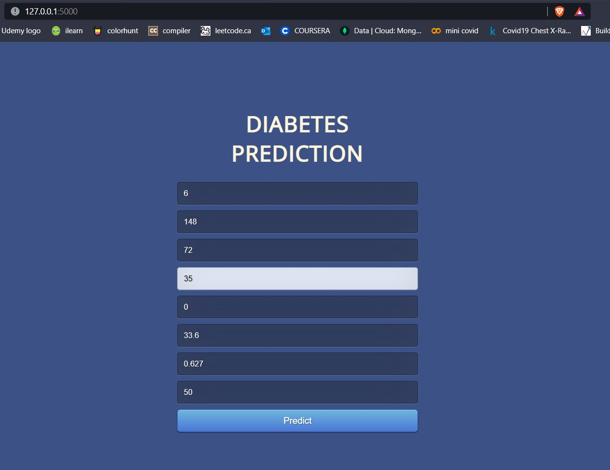
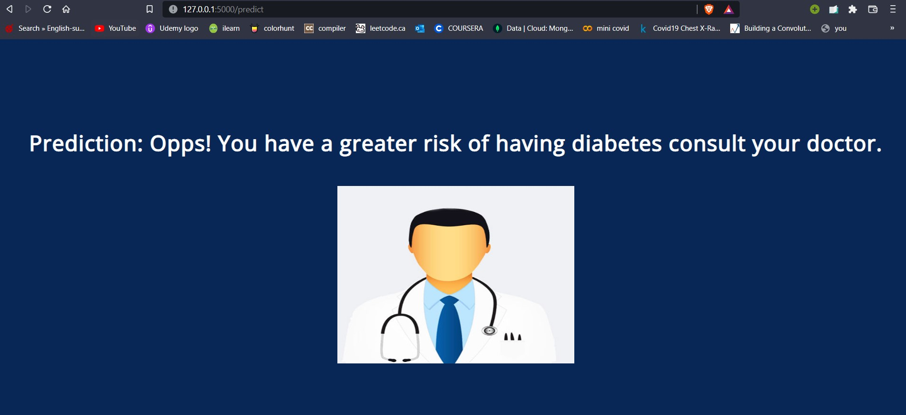
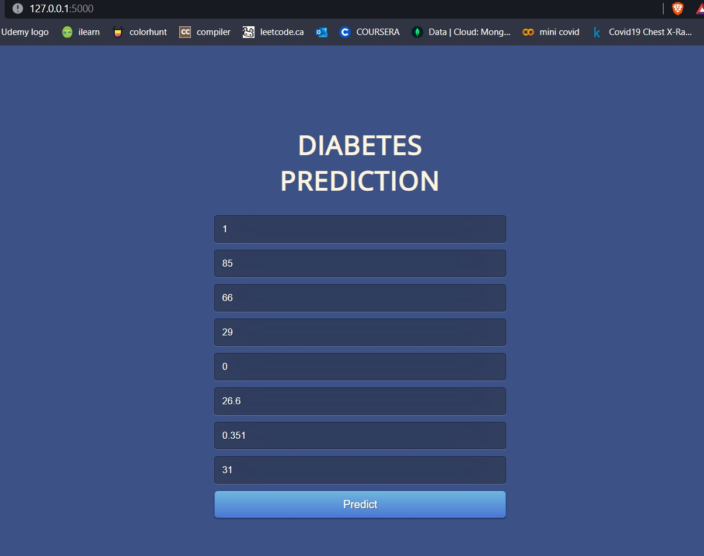
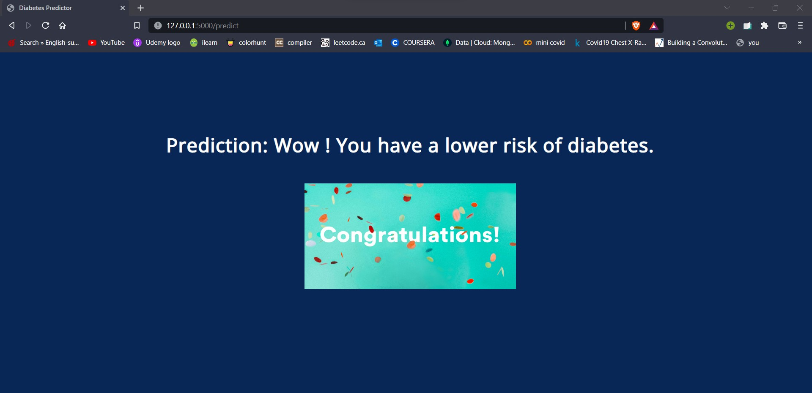

# Diabetes Prediction
<b>
Created Model for predicting diabetes in a patient using Machine Learning. Random forest algorithm is used for better accuracy as it establishes the outcome based on the predictions of the decision trees. PIMA dataset is used for training the model. Model is Integrated with web application using Flask.
</b>

<h2>SNAPSHOTS</h2>

<h3>Sample data 1</h3>

<h3>Sample output 1</h3>

<h3>Sample data 2</h3>

<h3>Sample output 2</h3>

